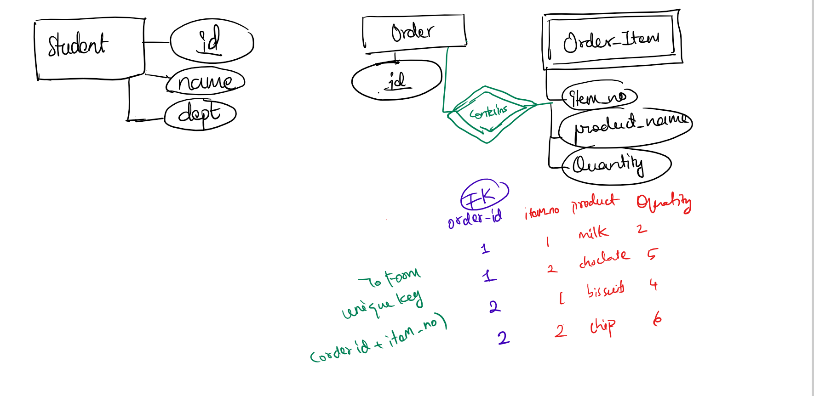
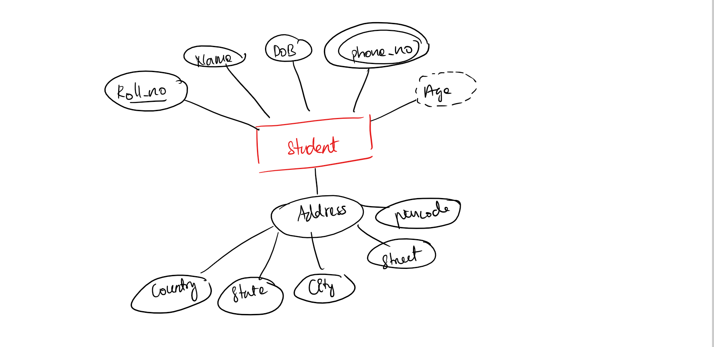
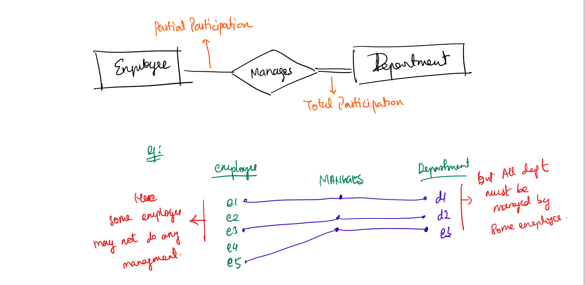
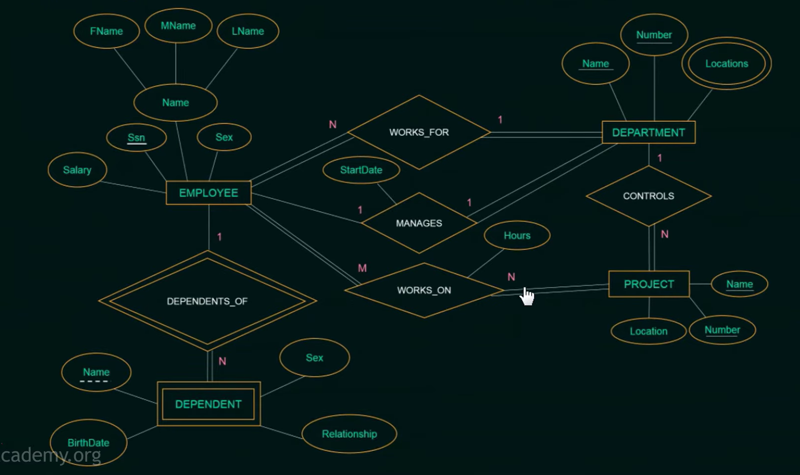

# entity relations (ER)

## Types of entity

- strong
  - An entity that has its own primary key
  - exists independently
  - :single rectangle
- weak
  - An entity that does NOT have a primary key
  - Depends on a strong entity
  - identified use
    - partial key
    - primary key of strong entity
  - :double rectangle

## example 01

## TYPES OF ATTRIBUTES

- simple - age, name
- composite - address
- derived - age ( from dob )
- multi valued - phone number
- key attribute - roll no

## example 02

## relationship

- relationship -> association among 2 or more entities.
- eg: teacher teaches student, where teaches is relationship.
- degree of relationship:
  - denotes the no of entity types that participate in a relationship.
  - unary ( degree 1 )
    - eg: person <-> is_married_to
  - binary ( degree 2 )
    - eg: publisher <- publishes -> book
  - ternary ( degree 3 )
    - eg: subject, teacher, student ( teaches )
  - n-ary ( n degree )
    - eg: n number of entities related.

## relationship constraints

- `1.` cardinality ratio
  - max no of relations instances that an entity can participate in
  - ratios for binary
    - 1:1, 1:n, n:1, n:n
  - eg: 1 employee to 1 dept
  - eg: n employee to 1 dept
  - eg: n student to n subjects
- `2.` participation constraints:
  - It specifies whether an entity must participate in a relationship or not.
  - types
    - Total Participation (Mandatory) :double line
    - Partial Participation (Optional) :single line

## example 03

## steps to follow

1. identify entities
2. identify relationships
3. add attributes
4. define primary key
5. remove redundancies : remove unwanted & repetitive entities and relationships.
6. review for clarity
